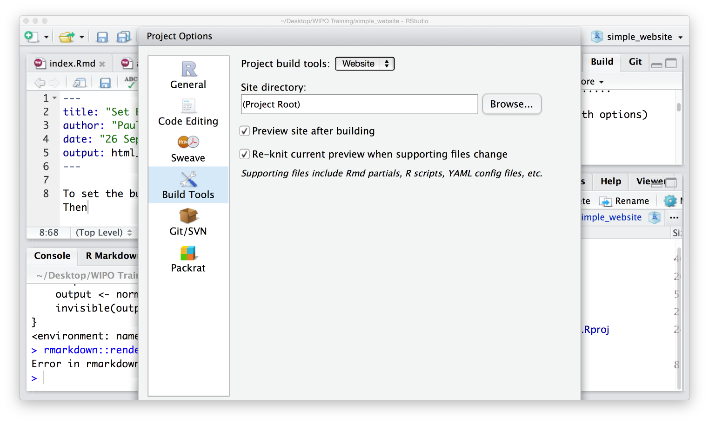

To set the build options choose `Build` from the RStudio menu. Then `Configure Build Tools`. From the `Project build tools` dropdown menu choose `Website`. Leave everthing else as is. Hit OK. RStudio now knows that you want to build a website (the `Website` setting is also used for books with the `bookdown` package). 

```{r echo = FALSE, out.width = "100%", fig.align = "center"}

```


