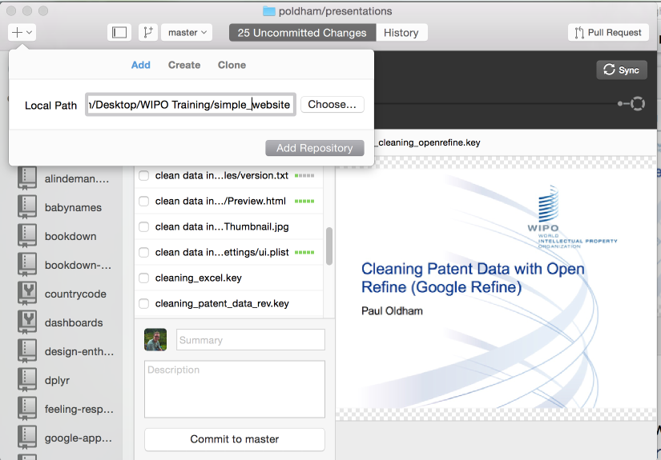
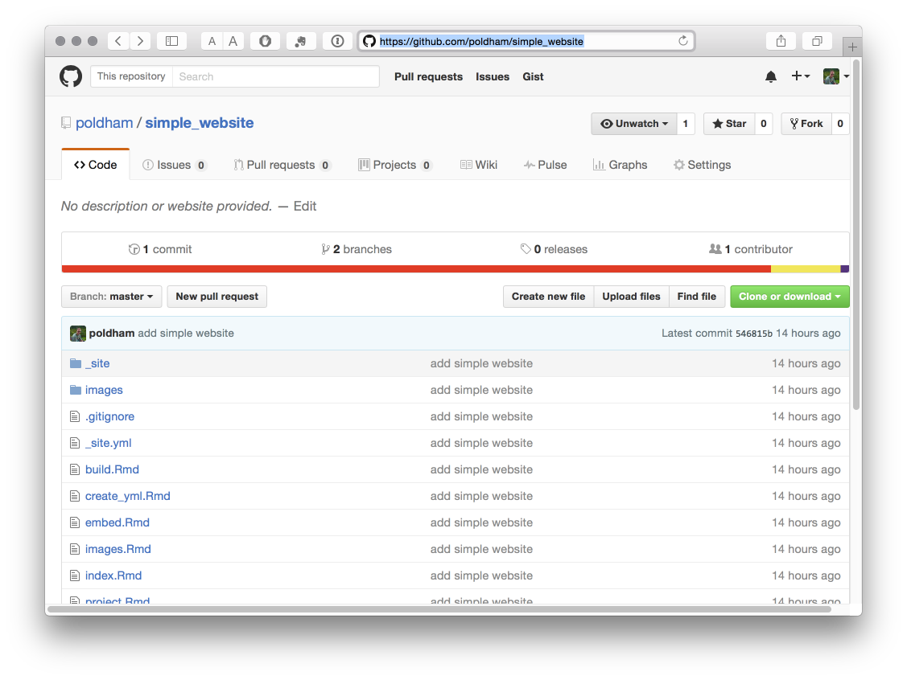
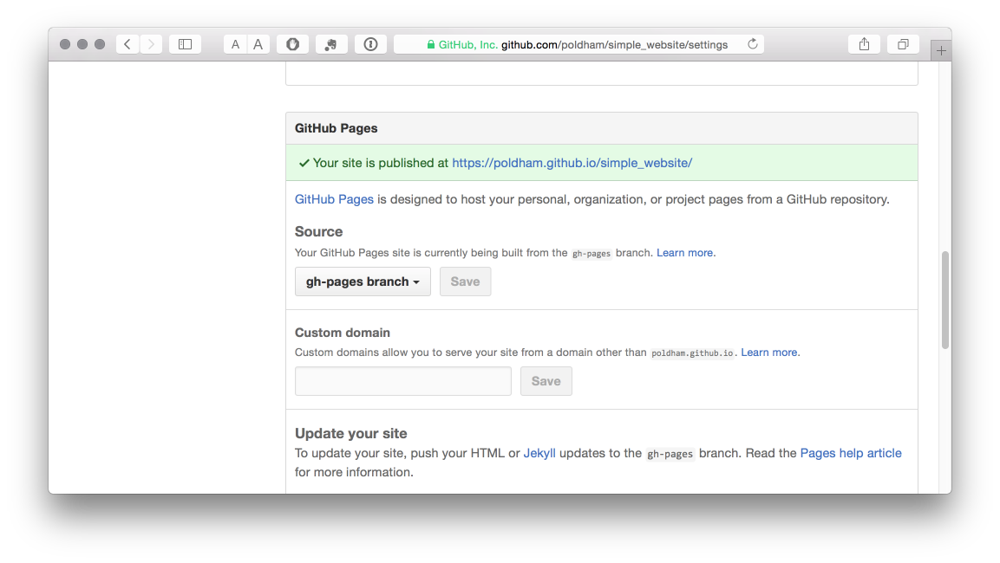

```{r setup, include=FALSE}
knitr::opts_chunk$set(echo = TRUE)
```

## Github

We will assume that you will be publishing to Github using Github desktop (rather than directly from RStudio which takes a little more set up).

1. Create an empty text file `.nojekyll` and save it at the root of the site (normally the project folder). Ignore any warnings about the file type. Because it starts with `.` the file will not show up in the file listing. However, this tells Github not to try and build the site with jekyll (the default for Github). If you have forked and cloned this site from Github this has been done for you.

2. In the `_site.yml` add a line with `output_dir: "."`. If you have forked and cloned this site from Github this has been done for you.

3. The site files are sent to `_site` in your project folder. Move `index.html` to the main project folder (the site root) or it will not build when you push it to Github. If you have forked and cloned this site then this has been done for you.

4. If you can't already see your project folder then add your project folder to github desktop. Write a quick message in Summary the Press commit and then sync. This will add the site to your github repositories.



5. Github will allow you to publish project websites for each repository (known as github pages or `gh-pages`). They will end up being published at `yourusername.github.io/repositoryname`. 

For example, the home for this website is [https://github.com/poldham/simple_website](https://github.com/poldham/simple_website)



But, this is where we need to take care. In the image above on the left we can see that next to `Branch` it says `master`. Websites are published on the github pages branch (`gh-pages`) branch of a repository to keep them separate (because your repository data and your project website may be quite different things). So, your website is not yet published. 

To publish the website we need to go into `Settings` in our repository and then scroll down. In the image below, where you see `master` in your repo change the branch to `gh-pages`. Your simple website will now build at the address given. You are reading this online so it must do. 


If you have forked and cloned this site then all should be good, because the master branch has been deleted leaving only the `gh-pages` branch. However, if you have started from scratch you will need the procedure above.

6. Troubleshooting. It can take a few minutes (but not long) for Github to recognise the website. If you see a not found message check three things. 

- That you have a line saying `output_dir: "."` at the bottom of `_site.yml`.
- That you have `.nojekyll` in your main site folder.
- That there is an index.html (you remembered to move it from the `_site` folder when you updated... easy to forget).
- That you have selected the `gh-pages` branch in `Settings` in your repo.
- If you are using this site as your basis make sure that you have forked and then cloned the repository (the fork makes it your copy, a clone is just a copy).


