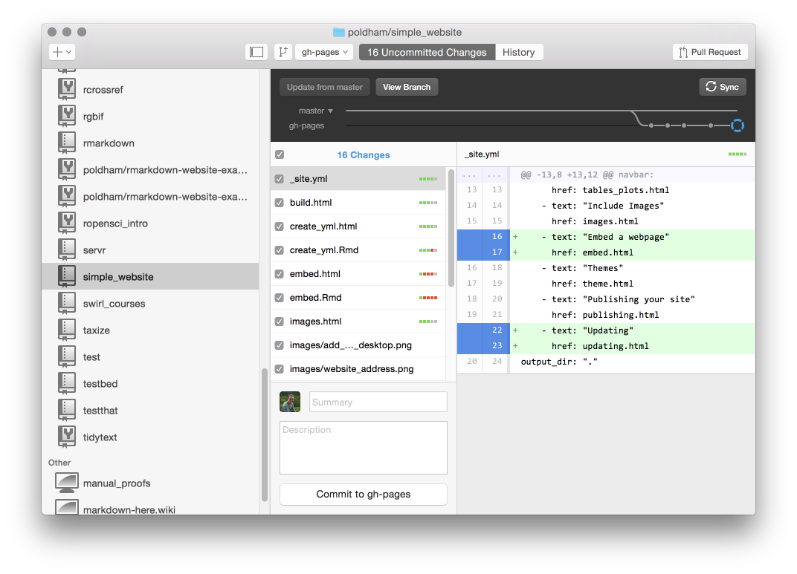

```{r setup, include=FALSE}
knitr::opts_chunk$set(echo = TRUE)
```

Your website lives on the `gh-pages` branch of your Github repository. This means that in Github desktop when you want to commit changes you must select the `gh-pages` branch as in the image below. 



If you find that your website has not built (and everything at the end of the last section is in place) it is probably because you have committed to the `master` rather than `gh-pages` in Github desktop. 

If you use RStudio regularly you may prefer to update directly from inside RStudio as part of your workflow. If so, follow these very useful instructions on how to get set up to [commit and push directly from RStudio](http://www.molecularecologist.com/2013/11/using-github-with-r-and-rstudio/).
